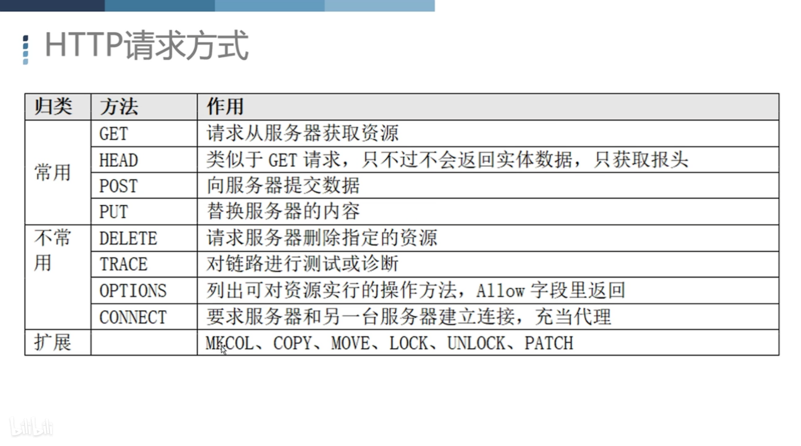
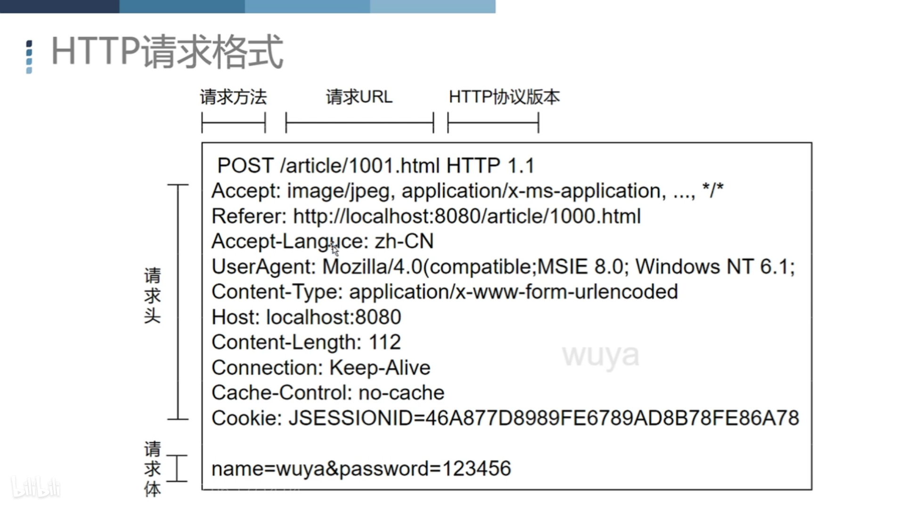
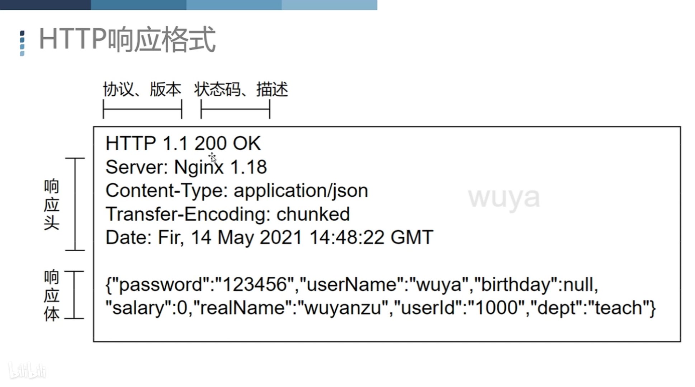
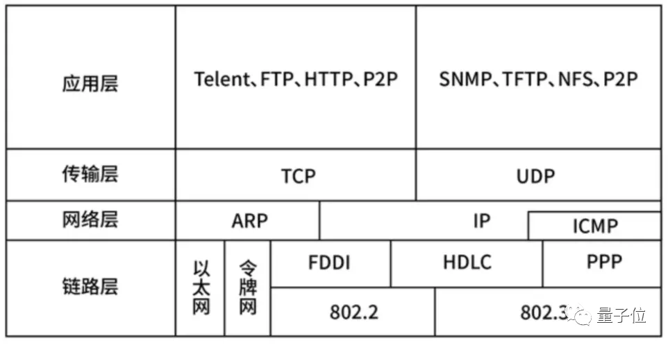

## http协议  
**http协议请求方式**  

**http协议请求格式**  

**http响应格式**  

**http通信协议特点** 
1. 可靠传输  
http协议工作在应用层的协议，它的下一层是传输层TCP/IP协议（三次握手，四次挥手）

2. 请求应答模式
3. 灵活可扩展
4. 无状态stateleas

## cookie
**下发流程**  
第一次访问服务器时，服务端下发cookie，客户端在本机保存在内存或者磁盘上面。之后每次请求服务端都带上服务端发给我的cookie，包含在cookie字段里。  
**特点**  
1. 为了解决http无状态的特性而诞生。
2. 明文，不需要加密。
3. 可任意修改
4. 大小数量受限制。
5. 记住登录状态，跟踪用户行为。
6. cookie是不能跨浏览器使用的。

## session 
**用途**   
cookie存储在本地占用空间，每次http请求都要带上cookie字段拖慢速度，所以将cookie存储在服务器，服务器下发给浏览器一个sessionid  

**特点**  
1. 基于cookie工作。

**session的创建，校验，销毁**  
1. 第一次登录，开启会话，将登录信息保存在session，将sessionid发给客户端。
2. 第二次访问，客户端发送包含sessionid的的cookie。
3. 销毁session，过期cookie。

