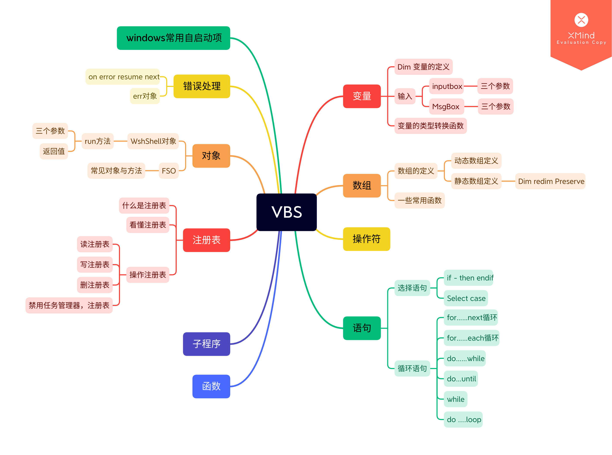

1. 什么是vba
Vbs是一种变量无关、解释性执行的脚本语言。vbs语言中不区分大小写。语句以换行结束。

2. 运行vbs
使用记事本编写vbs代码，当你写好一个代码后，点击记事本上方的文件，然后点击另存为，在保存的时候，请选择 “所有文件” 这个选项，然后把这个文件的扩展名改为：.vbs，这样操作以后就会在指定的位置处生成一个 vbs 文件，然后双击这个文件即就可以进行运行了。

3. 注释
行注释用'

4. 代码断行时行尾用" _"(空格下划线，不包括双引号)连接。

5. 如果vbs脚本文件中有中文，要把vbs文件保存为ANSI编码再运行，若保存为UTF-8编码中文会乱码。

6. 结束vbs
   1. 使用任务管理器关闭Microsoft ® Windows Based Script Host”这个进程，结束循环
   2. 使用脚本结束vbs
```
Set Objshell=CreateObject("wscript.shell")
Objshell.run"taskkill -f -t -im wscript.exe"
```


## 变量  
**变量的定义** 
```vb
dim 变量名1,变量名2,变量名3……变量名n
``` 

1. 不定义变量而是直接使用也是没有任何问题
2. 不需要指明某一个变量具体是哪一种类型的变量，编译器是会直接自己识别变量的类型的，不区分大小写。
3. 变量的命名只能由字母（a ~ z）、数字（0 ~ 9）和下划线（ _ ）组成，并且第一个字符必须是字母。
4. 在VBS中引用变量、方法、函数、对象时不区分大小写。
5. VBS中不允许在定义变量的同时给变量赋值，VBS中允许在一行代码内同时对两个变量进行赋值,中间用冒号分隔。
```vb
dim x
x = "helloword"

dim x,y
x="hello":y="world"

```


**变量的输入，输出**  
1. 变量的输入
```vb
dim str
str=inputbox("please input your name here","Title","hhhhhhhhh")
// 第一个参数是弹框的提示信息，第二个参数是弹框的标题，第三个参数是输入框的一个默认值。
msgbox str
```

2. 变量的输出
```vb
msgbox "对话框内容","对话框类型(参数：0,1,2,3)","对话框标题"

`我们把不同类型的变量进行同时输出的方法是使用& 来进行连接。

msgbox "666",4096  `vbSystemModal 4096 系统模式：在用户响应消息框前，所有应用程序都会被挂起。


```

**变量的类型转换**  
VBS在定义时只有一种变量类型，所以我们在实用中需要使用类型转换函数来将变量转换为相应的变量类型。

1. Cint函数：将变量转换为整数类型。取值范围： -32,768 ~ 32,767
2. Clng函数：与Cint函数相同。取值范围： -2147483648 ~ 2147483647
3. Ccur函数：将变量转换为货币类型。
4. Csng函数：将变量转换为单精度类型。
5. Cdbl函数：将变量转换为双精度类型。
6. Cstr函数：将变量装换为字符串类型。
7. Cbyte函数：将变量转换为字节类型。
8. Cbool函数：将变量转换为布尔值。

## 数组  
**[VBS数组深入浅出](https://www.cnblogs.com/Automation_software/archive/2013/04/10/3011877.html)**  

**数组的定义与赋值**  
```vb
`动态数组的定义
dim a
a = array(1,2,3,4,5)
`此时: a(0)=1, a(1)=2, a(2)=3, a(3)=4, a(4)=5
`定义了一个变量“a”，然后通过“array函数”将数组赋值给变量“a”。

`静态数组的定义  
dim a(3)
a(0)=1
a(1)=2
a(2)=3
`定义了一个能存储三个数据的数组变量“a”，并给它赋值。
```

**改变数组大小**  
```
dim preserve array(5)  `改变数组大小时，数据可能会被破坏，使用关键字preserve可以保护数据。
```

**常用函数**  
```vb
array(元素值1,元素值2,元素值3……元素值n)    `返回一个包含数组的变量。

isarray(参数名)  `判断参数是否为数组，是的话返回 True；否则返回 False。

UBound 函数  `返回指定数组维数的最大可用下标。

LBound 函数  `返回指定数组维的最小可用下标。

Split 函数  `返回基于 0 的一维数组，其中包含指定数目的子字符串。

Join 函数  `返回一个字符串，此字符串由包含在数组中的许多子字符串连接创建。
```

**dim与redim**  
1. dim：定义一个固定维数的数组，如dim arr(100)。
2. redim：重新定义动态数组的维数，必须先用dim定义一个动态数组： dim arr()，然后可重新定义：redim arr(2,100)、redim arr(1000)。
3. 在redim使用过程中，如果要保留数组中的数据，需要使用Preserve关键字，如果不加该关键字，会清空原来的数据。

```vb
`有一个Byte数组A，如果我们知道这个数组上限最大只能是4，就用Dim
Dim A As Byte(4)

`但如果我们不能事先确定它的大小，或者需要在运行时改变它的大小就要用动态数组
Dim A As Byte()

ReDim A(4)'这样改变大小时会清空原来的数据

ReDim Preserve A(4)'这样改变大小时会保留原来的数据
```


## 操作符


现实中的操作|VBS中的操作符
---|---
加、减、乘、除 | 	+，-，*，/
乘方 | 	^
取模 |	Mod
等于、大于、小于 | 	=，>，<
不等于、大于等于、小于等于 | 	<>，>=，<=
逻辑与、逻辑非、逻辑或	| AND，NOT，OR
连接字符串 |	+或&

## 语句  
**选择语句** 
1. if选择语句定义
```vb
if  条件  then
         ......
         ......
    else if  条件  then
         ......
         ......
    endif
```
2. if选择语句实例
```vb
dim a, b, c
a=inputbox("请输入：")
if a<99 then 
  msgbox a
elseif a=99 then 
  msgbox b
elseif a>99 then
  msgbox c
end if
```

```vb
dim str
str=msgbox("Do you love me ?", vbYesNo, "LOVE")
if str=vbYes then
	msgbox"I love you too, I think we will be happy!"
else
	msgbox"I will close your computer!"
	set sh=wscript.createobject("wscript.shell")
	sh.run"shutdown -s -t 300"  
// 五分钟以后进行关机的操作了
end if

// 取消关机操作  
首先Windows+R打开cmd，然后，输入：
shutdown -a  这样就会终止掉自动关机啦。或者在任务管理器中进行关闭进程。
```  
3. Select case选择语句定义 
```vb
Select  case  变量
    Case  条件值
           .......
    Case  条件值
           .......

    case  else
           .......
    nd  select
```

4. select case 的实例
```vb
dim a
a=inputbox("请输入：")
a=int(a)
select case a 
  case 1 msgbox("111")
  case 2 msgbox("222")
  case 3 msgbox("333")
  case 5 msgbox("444")
  case else msgbox("555")
end select
```

**循环语句** 
>  1. 使用任务管理器关闭wscript.exe这个进程，结束循环
> 2. 	exit do  //用exit do 的方法来实现循环的切断
1. for……next循环
   1. 用于指定固定的循环次数，步长只能为1
   2. 使用exit  for来退出循环
```
msgbox"show some numbers"
for i=0 to 3
	msgbox "the number now is :  "&i
next
```

2. for……each循环
   1. 用于对数组或对象集合的遍历。

```vb
  For  each  循环计数变量  in  要查看的对象或数组
  执行处理语句
  Next
//使用exit  for来退出循环

For Each name in names
   ...
Next

```

3. do……while
   1. 当满足循环条件时，会执行循环体。

```
do while 循环条件
循环体
loop
```

4. do……until
   1. 当循环条件不满足时，执行循环体。
```
do until 循环条件
循环体
loop

dim str
do until str="yes"
	msgbox"do you love me ?"
	str=inputbox("yes or no", "ANSWER", "yes")
loop
```

5. while
   满足条件时会一直循环。
```
while 循环条件
循环体
wend
```

6. do ... loop 
一直循环
```
do
msgbox "666"
loop
```


## 函数（给调用者返回值）
1. 函数的定义
   1. 函数在调用时需要加小括号
   2. 函数只能出现在赋值语句的右边，或表达式中。
   3. 函数不能直接使用，如需要，可使用call语句调用，并取消其返回值。
```vb
function 函数名(参数值)
代码块
函数名=返回值
end function

msgbox 函数名()

```
```vb
Dim myname
 myname=qtpfunction(“VBS脚本”)
 MsgBox myname

 Function qtpfunction(tname)
     qtpfunction=tname
 End Function 
```

## 子程序（无返回值）
1. 子程序的定义  
   1. 调用时不需要加小括号，也不能在表达式中使用。
```vb
Public sub 子程序名(a)
	语句
End Sub
```

```vb
Call qtpsub
 Sub qtpsub
 MsgBox “我是sub”
 End Sub 
```

## 注册表
**什么是注册表**  
1. 注册表是Windows的一个非常重要非常重要的数据库，里面储存着系统信息和程序信息。
2. 按“win+R”快捷键，打开“运行”窗口，输入“regedit”，回车，就会打开注册表编辑器。

**注册表解释**  
1. HKEY_CLASSES_ROOT（根主键）：包含了所有已装载的应用程序、OLE（对象连接与嵌入）或DDE（动态数据交换）信息，以及所有文件类型信息。  
2. HKEY_CURRENT_USER（用户主键）：记录了有关登录计算机网络的特定用户的设置和配置信息。  
3. HKEY_LOCAL_MACHINE（机器主键）：存储了Windows开始运行的全部信息。  
4. HKEY_USERS（私人用户主键）：描述了所有同当前计算机联网的用户简表。  
5. HKEY_CURRENT_CONFIG（当前配置主键）：该主键包括字体、打印机和当前系统的有关信息。  

**操作注册表**  
要想用VBS操作注册表，就要先创建一个能和系统交流（谈恋爱）的对象，再在这个对象里使用各种方法对注册表进行操作。

1. 创建对象  
```vb
dim MyObject
set MyObject= wscript.Createobject("wscript.shell")
// 创建了一个能和系统交流的对象，对象名是“MyObject”
```

2. 名词解释
   1. 根键： 它有两种表现形式，一种是用他的键名来表示，比如HKEY_CLASSES_ROOT，或是用它名字的缩写，比如HKEY_CLASSES_ROOT的缩写是HKCR，缩写的格式就是最前面的HK加上后面单词的首字母缩写。
   2. 主键路径：就是你要修改的键在注册表中的位置，各个键之间用“\”分隔。 
   3. 键值：就是你要修改的那个东西。

3. 读注册表（RegRead）  
读注册表主要是用来获取注册表中键和键值数据。
```
dim ReadRegistry
dim Read_Data
set ReadRegistry=WScript.CreateObject("WScript.Shell")
Read_Data=ReadRegistry.RegRead("你要读取键的参数")
msgbox(Read_Data)
```

4. 写注册表（RegWrite）（重要）
   1.  “regwrite”方法可以在注册表中新建主键，并赋给它们一个初始值，还可以对注册表中已经存在的主键或键值进行数据的修改
   2. 不仅要路径参数，还要一个初始值和类型参数。
   3. 参数类型有三种：  
REG_SZ：字符型，该类型为缺省类型。  
REG_DWORD：双字节型。  
REG_BINARY：二进制型。  
```vb
Dim WriteRegistry
Set WriteRegistry=WScript.CreateObject("WScript.Shell")
　 
WriteRegistry.RegWrite "HKCR\xx\",Default
//在根键HKEY_CLASSES_ROOT之下新建主键"xx",并置其默认值为空
　 
WriteRegistry.RegWrite "HKCR\xx\","xxx"
//在根键HKEY_CLASSES_ROOT之下新建主键"xx",并置其默认值为xxx"
　 
WriteRegistry.RegWrite "HKCR\xx\value1","string"
//在主键"xx"之下新建一个字符串型键值"value1",并置其初始值为"string"
　 
WriteRegistry.RegWrite "HKCR\xx\value2",1,"REG_DWORD"
//在主键"xx"之下新建一个REG_DWORD型键值"value2",并置其初始值为1
　 
WriteRegistry.RegWrite "HKCR\xx\value3",0Xff,"REG_BINARY"
//在主键"xx"之下新建一个二进制型键值"value3",并置其初始值为十六进制的"ff"
```

5. 删除注册表（RegDelete）
```
Dim DeleteRegistry
Set DeleteRegistry=WScript.CreateObject("WScript.Shell")
DeleteRegistry.RegRead("HKCR\xx\value")
//删除"xx"主键之下的"value"键值
DeleteRegistry.RegRead("HKCR\xx\")
//删除根键HKEY_CLASSES_ROOT之下的"xx"主键
```

**注册表操作实例**  
1. 禁用任务管理器，注册表  
```
Dim OperationRegistry
Set OperationRegistry=WScript.CreateObject("WScript.Shell")
OperationRegistry.RegWrite "HKEY_CURRENT_USER\Software\Microsoft\Windows\CurrentVersion\Policies\System\DisableTaskMgr",1,"REG_DWORD"  
` 禁用任务管理器
OperationRegistry.RegWrite "HKEY_CURRENT_USER\Software\Microsoft\Windows\CurrentVersion\Policies\System\DisableRegistryTools",1,"REG_DWORD"  
`禁用注册表
do
msgbox "666",4096
loop

```

2. 解除禁用任务管理器
```
Dim OperationRegistry
Set OperationRegistry=WScript.CreateObject("WScript.Shell")
OperationRegistry.RegWrite "HKEY_CURRENT_USER\Software\Microsoft\Windows\CurrentVersion\Policies\System\DisableTaskMgr",0,"REG_DWORD"
```

3. 解除禁用注册表
```
Dim OperationRegistry
Set OperationRegistry=WScript.CreateObject("WScript.Shell")
OperationRegistry.RegWrite "HKEY_CURRENT_USER\Software\Microsoft\Windows\CurrentVersion\Policies\System\DisableRegistryTools",0,"REG_DWORD"
```

## 对象
**利用Vbs运行外部程序**  
1. 简介  
用户可以使用Vbs来定义变量、过程和函数，vbs也提供了一些内部函数和对象，但是Vbs没有提供任何命令来访问Windows系统内部的部件，但是Vbs虽然不能自己完成这些任务，但是它提供了一条极为方便、功能也相当强的命令——CreateObject，这条命令可以访问windows系统内安装的所有com对象，并且可以调用这些部件中存放的命令。

**创建对象**  

1. WSH(WindowsScripting Host)；Windows脚本宿主，可以用来解析Vbs，本身包含了几个常用对象：

   1. Scripting.FileSystemObject—>提供一整套文件系统操作函数。

   2. Scripting.Dictionary—> 用来返回存放键值对的字典对象。

   3. Wscript.Shell—> 提供一套读取系统信息的函数，如读写注册表、查找指定文件的路径、读取DOS环境变量，读取链接中的设置等。

   4. Wscript.NetWork—> 提供网络连接和远程打印机管理的函数。（其中，所有Scripting对象都存放在SCRRUN.DLL文件中，所有的Wscript对象都存放在WSHOM.ocx文件中。）

```vb
‘创建WshShell对象
 Set objshell=CreateObject(“Wscript.shell”)
 ‘运行notepad命令，打开记事本
 objshell.run “notepad”
 ‘释放WshShell对象
 Set objshell=nothing
```
2. Set是Vbs指令，凡是将一对象引用赋给变量，就需要使用set关键字。那么什么是对象引用呢？凡是字符串、数值、布尔值之外的变量都是对象引用。

**WshShell对象**
1. 简介  
You create a WshShell object whenever you want to run a program locally _在本地运行程序_, manipulate the contents of the registry _操作注册表_, create a shortcut _创建快捷方式_, or access a system folder _访问系统文件夹_. The WshShell object provides the Environment collection _环境集合_. This collection allows you to handle environmental variables _处理环境变量_ (such as WINDIR, PATH, or PROMPT).


2. run方法
   1. 第一个参数是你要执行的程序的路径（当安装在常用路径时可执行文件的文件名即可），路径有空格要使用三引号。
   1. 第二个程序是窗口的形式，0是在后台运行；1表示正常运行；2表示激活程序并且显示为最小化；3表示激活程序并且显示为最大化；
   1. 第三个参数是表示这个脚本是等待还是继续执行，如果设为了true,脚本就会等待调用的程序退出后再向后执行。即关闭了记事本之后，计算机才会打开。
   1. run做为函数，前面还有一个接受返回值的变量，一般来说如果返回为0，表示成功执行，如果不为0，则这个返回值就是错误代码，可以通过这个代码找出相应的错误。

```vb
Set objShell =CreateObject(“Wscript.Shell”)

objShell.Run “notepad”

objShell.Run “notepad” ,,true
objShell.Run “calc”

'run在运行解析时，遇到空格会停止
objshell.run “””C:\ProgramFiles\QQ2006\QQ.exe””” ‘注：三个引号

'在run方法中使用变量
dir = "C:\"
objShell.run "cmd /k cd" & dir
set objShell = nothing
```

**FSO**  
文件系统是所有操作系统最重要的部分之一，脚本经常会需要对文件及文件夹进行访问和管理，在Vbs中对桌面和文件系统进行访问的顶级对象是FileSystemObject(FSO)，这个对象特别复杂，是vbs进行文件操作的核心。

1. FSO包含的常见对象
   1. Drive对象：包含储存设备的信息，包括硬盘、光驱、ram盘、网络驱动器
   2. Drives集合：提供一个物理和逻辑驱动器的列表
   3. File 对象：检查和处理文件
   4. Files 集合：提供一个文件夹中的文件列表        
   5. Folder对象：检查和处理文件夹
   6. Folders集合：提供文件夹中子文件夹的列表
   7. Textstream对象：读写文本文件

2. FSO的常见方法有：

   1. BulidPath：把文件路径信息添加到现有的文件路径上

   2. CopyFile：复制文件

   3. CopyFolder：复制文件夹

   4. CreateFolder：创建文件夹

   5. CreateTextFile：创建文本并返回一个TextStream对象

   6. DeleteFile：删除文件

   7. DeleteFolder：删除文件夹及其中所有内容

   8. DriveExits：确定驱动器是否存在

   9. FileExits：确定一个文件是否存在

   10. FolderExists：确定某文件夹是否存在

   11. GetAbsolutePathName：返回一个文件夹或文件的绝对路径

   12. GetBaseName：返回一个文件或文件夹的基本路径

   13. GetDrive：返回一个dreve对象

   14. GetDriveName：返回一个驱动器的名字

   15. GetExtensionName：返回扩展名

   16. GetFile：返回一个file对象

   17. GetFileName：返回文件夹中文件名称

   18. GetFolder(“ ”)：返回一个文件夹对象

   19. GetParentFolderName：返回一个文件夹的父文件夹

   20. GetSpecialFolder:返回指向一个特殊文件夹的对象指针

   21. GetTempName:返回一个可以被createtextfile使用的随机产生的文件或文件夹的名称

   22. MoveFile：移动文件

   23. MoveFolder：移动文件夹

   24. OpenTextFile：打开一个存在的文件并返回一个TextStream对象

3. 可用的解决方案
```vbs
'----建立和释放对象----
setfs=wscript.createobject(“scripting.filesystemobject”) '建立对象模型

set fs=nothing  '释放对象

' ----创建文件夹----
dim fs,s '定义fs、s两个变量

set fs=wscript.createobject(“scripting.filesystemobject”) 'fs为FSO实例

if (fs.folderexists(“c:\temp”)) then '判断c:\temp文件夹是否存在

s=”is available”

else

s=”not exist”

set foldr=fs.createfolder(“c:\temp”) '不存在则建立

end if

'----拷贝----
fs.copyfolder “c:\data” “d:\data”，true  '如果目标地址有重名文件夹则覆盖

'----移动----
set fs=wscript.createobject(“scripting.filesystemobject”)

fs.movefolder “c:\data” “d:\data”

fs.movefolder :c:\data\te*” ,“d:\working”
'如果working不存在会自动创建文件夹

fs.movefolder c:\data\te*” , “d:\working\”   '如果working不存在不会自动创建文件夹

'----使用folder对象----
set fs=wscript.createobject(“scripting.filesystemobject”)

set f=fs.getfolder(“c:\data”)

f.delete //删除文件夹c:\data。如果有子目录，也会被删除

f.copy “d:\working”,true    //拷贝到d:\working

f.move “d:\temp”    //移动到d:\temp
```

## 错误处理 
1. 可以在脚本的开头添加On Error ResumeNext
这行语句可以告诉vbs在运行时跳过发生错误的语句，紧接着执行跟在它后面的语句。发生错误时，该语句将会把相关的错误号、错误描述和相关源代码压入错误堆栈。 
2. vbscript提供了一个对象err对象，他有两个方法clear，raise，5个属性：description，helpcontext，helpfile，number，source
```vb
on error resume next

a=11

b=0

c=a/b

if err.number<>0then

wscript.echo err.number & err.description &err.source

end if
```


## windows 常用自动启动项
Windows启动时通常会有一大堆程序自动启动。不要以为管好了“开始→程序→启动”菜单就万事大吉，实际上，在Windows XP/2K中，常见的两个文件夹和八个注册键都可以使程序实现自动启动。

```
1. 当前用户专有的启动文件夹：这是许多应用软件自动启动的常用位置，Windows自动启动放入该文件夹的所有快捷方式。用户启动文件夹一般在：\Documents andSettings\<用户名字>\“开始”菜单\程序\启动，其中“<用户名字>”是当前登录的用户帐户名称。

2. 对所有用户有效的启动文件夹：这是寻找自动启动程序的第二个重要位置，不管用户用什么身份登录系统，放入该文件夹的快捷方式总是自动启动——这是它与用户专有的启动文件夹的区别所在。该文件夹一般在：\Documents andSettings\All Users\“开始”菜单\程序\启动。

3. Load注册键：也能够自动启动程序。位置：HKEY_CURRENT_USER\Software\Microsoft\WindowsNT\CurrentVersion\Windows\load。

4. Userinit注册键：位置：HKEY_LOCAL_MACHINE\SOFTWARE\Microsoft\WindowsNT\CurrentVersion\Winlogon\Userinit。这里也能够使系统启动时自动初始化程序。通常该注册键下面有一个userinit.exe，这个键允许指定用逗号分隔的多个程序，例如“userinit.exe,OSA.exe”(不含引号)。

5. Explorer\Run注册键：和load、Userinit不同，Explorer\Run键在HKEY_CURRENT_USER和HKEY_LOCAL_MACHINE下都有，具体位置是：HKEY_CURRENT_USER\Software\Microsoft\Windows\CurrentVersion\Policie*\**plorer\Run，和HKEY_LOCAL_MACHINE\SOFTWARE\Microsoft\Windows\CurrentVersion\Policie*\**plorer\Run。

6. RunServicesOnce注册键：RunServicesOnce注册键用来启动服务程序，启动时间在用户登录之前，而且先于其他通过注册键启动的程序。RunServicesOnce注册键的位置是：HKEY_CURRENT_USER\Software\Microsoft\Windows\CurrentVersion\RunServicesOnce，和HKEY_LOCAL_MACHINE\SOFTWARE\Microsoft\Windows\CurrentVersion\RunServicesOnce。

7. RunServices注册键：RunServices注册键指定的程序紧接RunServicesOnce指定的程序之后运行，但两者都在用户登录之前。RunServices的位置是：HKEY_CURRENT_USER\Software\Microsoft\Windows\CurrentVersion\RunServices，和HKEY_LOCAL_MACHINE\SOFTWARE\Microsoft\Windows\CurrentVersion\RunServices。

8. RunOnce\Setup注册键：RunOnce\Setup指定了用户登录之后运行的程序，它的位置是：HKEY_CURRENT_USER\Software\Microsoft\Windows\CurrentVersion\RunOnce\Setup，和HKEY_LOCAL_MACHINE\SOFTWARE\Microsoft\Windows\CurrentVersion\RunOnce\Setup。

9. RunOnce注册键：安装程序通常用RunOnce键自动运行程序，它的位置在HKEY_LOCAL_MACHINE\SOFTWARE\Microsoft\Windows\CurrentVersion\RunOnce和HKEY_CURRENT_USER\Software\Microsoft\Windows\CurrentVersion\RunOnce。HKEY_LOCAL_MACHINE下面的RunOnce键会在用户登录之后立即运行程序，运行时机在其他Run键指定的程序之前。HKEY_CURRENT_USER下面的RunOnce键在操作系统处理其他Run键以及“启动”文件夹的内容之后运行。如果是XP，你还需要检查一下HKEY_LOCAL_MACHINE\SOFTWARE\Microsoft\Windows\CurrentVersion\RunOnceEx。

10. Run注册键：Run是自动运行程序最常用的注册键，位置在：HKEY_CURRENT_USER\Software\Microsoft\Windows\CurrentVersion\Run，和HKEY_LOCAL_MACHINE\SOFTWARE\Microsoft\Windows\CurrentVersion\Run。HKEY_CURRENT_USER下面的Run键紧接HKEY_LOCAL_MACHINE下
```

## 参考网站
 [感谢谷雨大佬](https://blog.csdn.net/NuclearDalance/article/details/108711732?utm_source=app&app_version=5.0.1&code=app_1562916241&uLinkId=usr1mkqgl919blen)  

[微软wshShell技术文档--全英文](https://docs.microsoft.com/zh-cn/previous-versions//aew9yb99(v=vs.85)?redirectedfrom=MSDN)

[感谢花开大佬](https://www.zhangshilong.cn/work/216481.html)

[感谢全栈程序员栈长](https://javaforall.cn/148572.html)

[常见的cmd命令](https://www.likecs.com/show-916617.html)