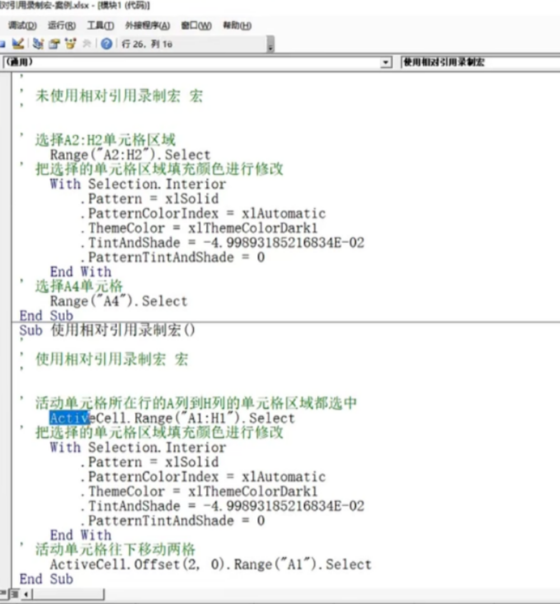
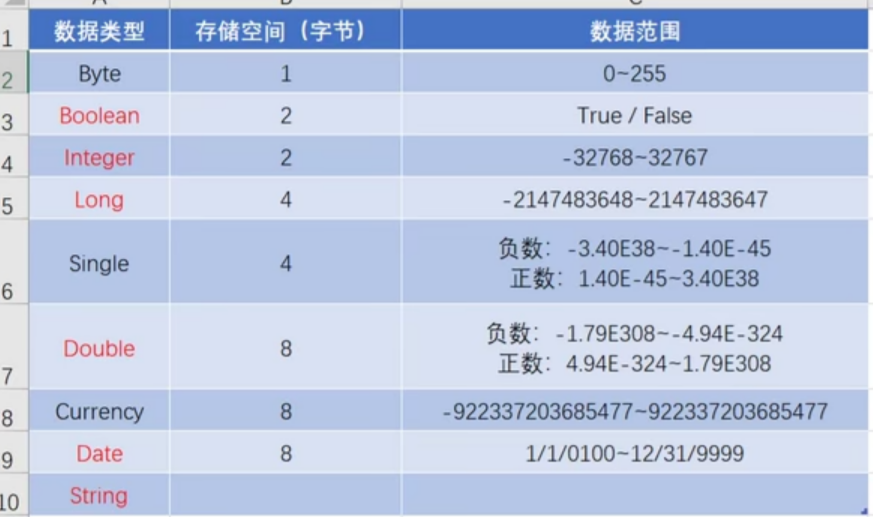
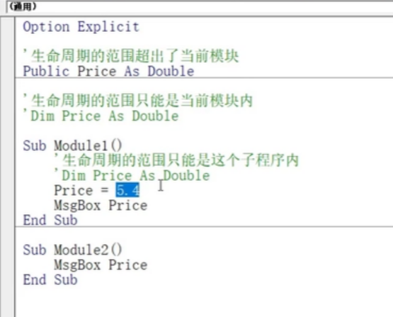
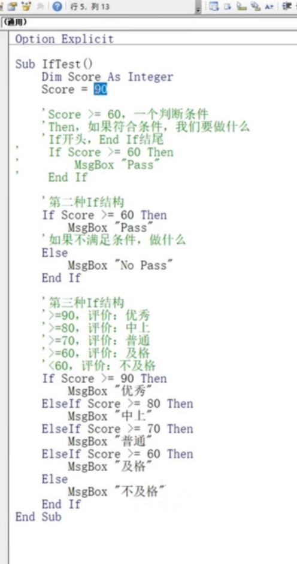
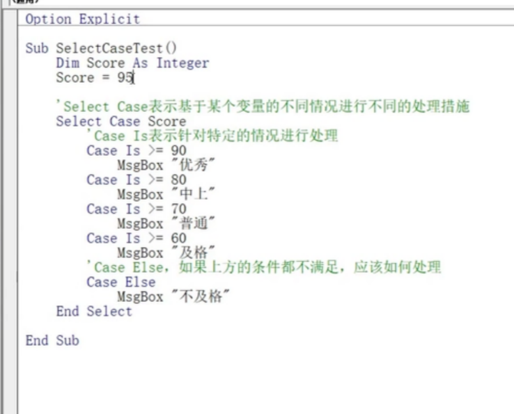
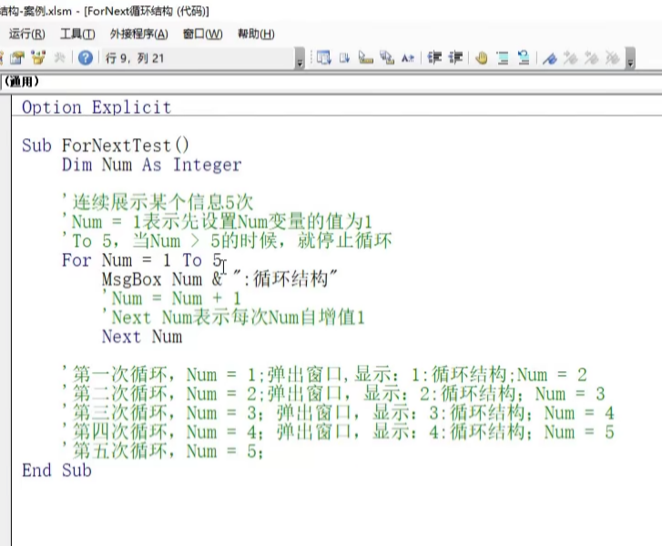
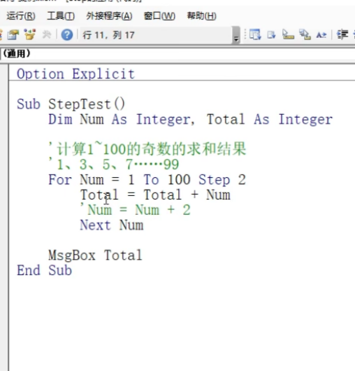
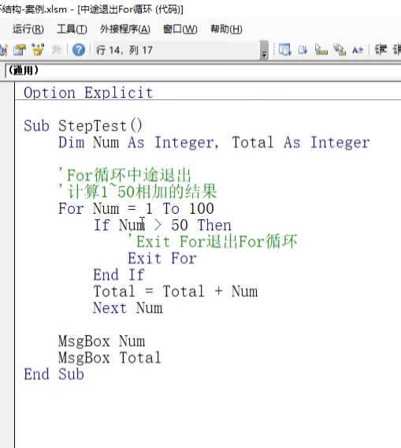
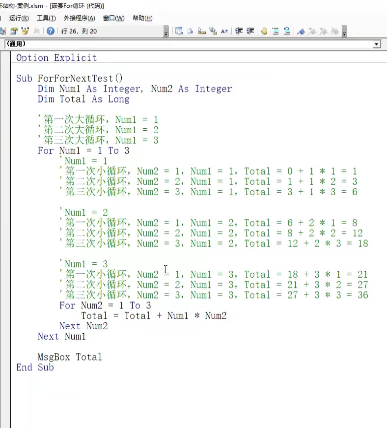

## 宏基础知识
**背景介绍**  
1. vba是一种编程语言，用vba编写的程序叫做宏。
2. 使用宏来进行重复性的数据处理。
3. 选项-自定义选项-勾选开发工具 
4. 宏程序有两种，一种是录制宏，一种是自己编写的宏。
5. excell为了保证安全机制对格式进行了区分，xlsx只能保存普通的excell文件，如果带有宏需要使用xlsm的后缀名。
6. 宏安全设置  
Excel选项-信任中心-信任中心设置-宏设置    
禁用宏  
受信任位置设置：在该路径下所以宏都默认没病毒。

**解决个人宏工作簿关不掉解决方案**  
进入C:\用户\使用者\AppData\Roaming\Microsoft\Excell\XLSTART\Personal.xlsb  删掉这个文件。

**录制宏**  
1. excell自动生成vba程序。
2. 使用快捷键重复某些简单操作。
3. 使用相对引用录制宏
   1. 不使用相对引用宏就选择固定的区域，使用相对引用会引入活动单元格的概念。
   2. 绝对引用与相对引用  
绝对引用-固定单元格-不管光标点哪里，A1都是所在表单的 A1  
相对引用-活动单元（acitvecell）-光标点哪里，哪里就是A1  
   3. offset函数  
offset（x,y） x=行移动的格数，迈了几步 y=列移动的格数

  

**运行宏**  
1. 表单控件运行宏
   1. 开发工具-控件-插入
   2. 关联宏
2. 快速访问工具运行宏
   1. 文件-选项-快速访问工具栏

**个人宏工作簿**  
1. 保存在单独工作簿中的宏，只有当该文档打开，才能在另外文档应用那个宏。
2. 选择保存到个人宏工作簿是保存在excell自动创建的隐藏文档中。当打开其它文档时，excell默认打开该隐藏文档。


**工程窗口**  
1. excell对象--针对某个工作簿编写的代码
2. 模块 针对宏的代码

## 编写宏程序

**在vbe中调试**  
1. 点击三角形开始按钮。
2. 视图-立即窗口
输入   call 宏名称

**弹窗口** 
```
Sub 第一个代码 （）
   MsgBox "弹窗的内容"
   MsgBox "单元格内容是" &      Range("A1").value
End Sub
```

**变量**  
1. 数据类型
   
2. 声明定义
```
Sub 声明变量 （）
  Dim a As Integer
  a = 100
  MsgBox a 

  Dim day As Date
  day = #11/20/2022#
  MsgBox day

  Dim b As String
  b = "hello world"
  MsgBox b

  Dim c As Boolean
  c = true
  MsgBox c

`多变量声明  
  Dim c As Boolean，b As String

`可变的变量声明
  Dim Var
  Var = 10
  var = "hello world"
End Sub
``` 
3. 备注：
    1. 日期类型的弹出显示根据系统的  日期-日期区域格式-短日期格式。
    2. 强制变量声明
       1. 当变量没有声明就被使用会报错。
       2. 在代码开头加上Option Explicit
       3. 工具-编辑器-要求变量声明
    3. sub外定义的变量是全局变量，sub内定义的变量只在该内有效。
    
    4. static关键词  
static c As Boolean  ——— c变量所在模块运行完之后不会销毁该变量。关闭工作簿或者重新设置才能销毁。

**数据类型的补充说明**  
1. double可以当做超大整型来用。
2. 

**常量**  
```
Sub Changliang ()
Const PI As Double = 3.14159
End Sub
```
1. 查看常量所代表的数值  
在立即窗口输入?常量。

**逻辑运算符**  
Not 取反  
And 与逻辑，一假为假  
Or  或逻辑，一真为真

**if选择结构**  


**Select选择结构**  
和c语言switch差不多


**ForNext选择结构**
1. 默认情况下一次加1  


2. 使用step改变循环增量


3. 使用Exit退出for循环


4. 嵌套for循环
