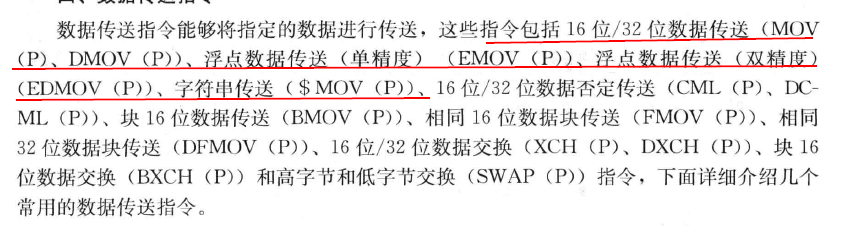
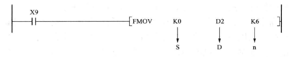
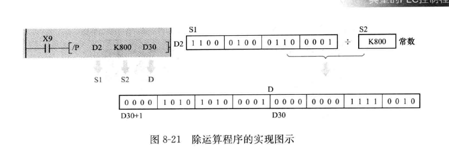

## 数据 
**数据类型**  

1. M是10进制标记的位类型

2. D是10进制标记的字类型

**16位数据（字数据）**  
1. 取值范围

2. 位软元件中的16位数据  

3. 理解k4x10

**32位数据（双字数据）**  
1. 取值范围

2. 位与数组中的32位数据

3. 理解K8M1000

## 软元件
**数值处理**  
十进制数(DEC： Decimal)

主要用于定时器和计数器的设定值(数字前加K)，辅助继电器M、定时器T、计数器C、状态S等的编号，执行应用指令操作数中的数值与指令动作(数字前加K)。

十六进制数(HEX：Hexadecimal)

用途与十进制数一样，用于指定应用指令中的操作数与指定动作(数字前加H)。

二进制数(BIN：Binary)

在PLC内部所有数值都以二进制的形式进行处理。对于负数而言，PLC内部以补码来表现。

八进制数(OCT：Octal)

PLC的输入、输出继电器软元件编号以八进制数值进行分配。

BCD码(BCD：Binary Code Decimal)

BCD码就是将构成十进制数每位上0~9的数值以四位二进制表示的形式。

实数(浮点数)  
通过浮点数运算可以提高运算结果的精度。PLC内部以二进制浮点数进行浮点运算，但可以采用10进制浮点数进行监控。

二进制浮点数使用编号连续的一堆数据寄存器进行存储，占用32位，最高位为符号位。

**输入输出继电器**  
1. 输入继电器(X)：从外部接受信号的窗口

2. 输出继电器(Y)：向外部负载发送信号的窗口

> 输入继电器[X]、输出继电器[Y]的编号是由基本单元持有的固定编号，和针对扩展设备连接顺序分配的编号组成的。这些编号采用8进制数，所以不存在“8”、“9”的数值。

> 输入继电器即为我们常说的“输入点”，它与PLC的输入端子相对应；输出继电器即为我们常说的“输出点”，它与PLC的输出端子相对应。一般PLC上都设有与输入输出继电器相对应的指示灯用来显示其ON/OFF状态。输入输出继电器是唯一能够在PLC上直接观测状态的内部软元件，它是PLC控制外围电气元件的桥梁。

>PLC工作时，首先将所有输入端子的ON/OFF状态读入到输入映像区，然后进行程序扫描执行用户程序，通过内部逻辑计算得到各种软元件的最新状态或内容，执行完毕后将输出映像区中输入继电器的状态输出到锁存内存中，最终映射到输出端子，从而完成了由输入到输出的执行过程。中间的用户程序环节是实现“控制”的关键。

**辅助继电器**  
>辅助继电器的线圈与输出继电器一样，是通过PLC中的软元件触点来驱动的。辅助继电器的常开触点和常闭触点无数量限制，在程序中可随意使用，但是不能通过辅助继电器触点直接驱动外部负载，PLC的外部负载全部通过输出继电器进行驱动。辅助继电器采用10进制分配编号。

> 一般用的辅助继电器不具备断电保持功能，PLC断电后其状态全部复位为OFF；而停电保持用的辅助继电器可以记忆断电前的状态并保持住，通过程序条件才能确定其状态的改变。

> 根据功能不同分为：一般用( M0-M499 )  
停电保持用(M500-M3071)  
特殊用(M8000-M8255)  
触点利用型特殊辅助继电器：  
M8000 运行监视(PLC运行时常ON)  
M8002 初始脉冲(PLC运行时第一扫描周期ON)  
M8013 1秒时钟脉冲  
M8200 32位计数器C200增计数/减计数模式的切换  
线圈驱动型特殊辅助继电器：  
M8034 输出全部禁止  
M8039 恒定扫描周期  
M8122 RS指令串行数据发送请求  

**状态器(S)**  
> 状态S是对工序步进形式的控制进行简易编程所需的重要软元件，需要与步进梯形图指令STL或顺序功能图SFC组合使用。

> 状态器与辅助继电器相同，有无数个常开触点和常闭触点，可以在顺控程序中随意使用。当状态不用于步进梯形图指令的时候，可以在一般的顺控程序中把它当做辅助继电器M来使用。

**定时器(T)**  
> 定时器的原理是用加法计算PLC中的1ms、10ms、100ms等的时钟脉冲，当加法计算的结果达到所指定的设定值时输出触点就动作的软元件。与我们普通的时间继电器功能一样

> 根据PLC型号的不同，其定时器编号范围以及代表的功能也不相同。定时器编号不用于定时器功能时可以当做数据寄存器用来保存数据(16位)。定时器可以分为一般用、累积型、电位器型等。

> 100ms定时器：T0-T199 定时范围0.1-3276.7s  
> 10ms定时器：T200-T245 定时范围0.01-327.67s  
> 1ms累积性定时器：T246-T249 定时范围0.001-32.767s  
> 100ms累积性定时器：T250-T255 定时范围0.1-3276.7s  
> T后面的数值可以是常数K，也可以由数据寄存器中的D值来指定，此时选用的时候一般选用掉电保持型数据寄存器。

**计数器和高速计数器(C)**  
计数器可以分为16位计数器和32位计数器。两种计数器都有一般用和停电保持用两种类型。计数器编号不用于计数器功能时可以当做数据寄存器用来保存数据。

16位计数器只能增计数，设定值范围为1~32767；32位计数器可以切换为增计数或减计数，设定值范围为-214783648~214783647。

计数器对PLC的内部信号X、Y、M、S、C等触点的动作进行循环扫描并计数，其响应速度根据PLC的扫描时间可推算通常在10Hz以下。但很多情况下输入信号的频率都会大于这个数值，这时就要用到高速计数器，高速计数器的计数采用中断处理，与PLC扫描时间无关，可以达到数KHz的计数。

高速计数器必须与外部端子X0~X7配合使用，并且根据高速计数器编号占用输入点的情况，一旦X点被占用后该点不能再用于其它用途。

**数据寄存器(D)**  
数据寄存器是存储数值数据的软元件，这些寄存器都是16位的，最高位为符号位，其余15位代表数值大小。两个连续的数据寄存器组合后可存储32位数据，在32位指令中只需指定低16位的数据寄存器，其紧接着的数据寄存器就会被自动占为高16位。在编程时需注意这点，以免重复使用数据寄存器造成逻辑混乱。

16位数据寄存器可以处理的数据范围为-32768~+32767，32位数据寄存器可以处理的数据范围为-2147483648~+2147483647。

数据寄存器也可以分为一般用、停电保持用和特殊用三种类型。

一般用：D0-D199 特殊用：D8000D8255

停电保持：D200-D511 变址寄存器：V0-V7 Z0-Z7

停电保持专用：D512-D7999

# 指令

## 顺控程序指令

### 触点指令
常开 ， 常闭
上升沿脉冲指令  仅在指定位元件上升沿时导通
下升沿脉冲指令  仅在指定位元件下降沿时导通

### 输出指令
#### OUT（线圈）
#### 定时器
定时器设置值只能使用10进制常数k
OUT T：低速定时器指令   
OUTH T：高速定时器指令  
OUT ST：低速累计定时器指令  
OUTH ST：高速累计定时器指令  
OUT指令之前的运算结果为ON时，线圈将ON并进行定时器的计测。如果时限到，常开触点将导通，常闭触点将变为非导通。  

定时器的时限设置是在工程工具的参数设置中进行。  
低速定时器/低速累计定时器：1～1000ms(默认：100ms，设置单位：1ms)   
1s=1000ms,OUT T01 K10 是延时1s
高速定时器/高速累计定时器：0.01～100.0ms(默认：10.0ms，设置单位：0.01ms)  

#### 计数器C
OUT C30 K3
对条件成立的次数进行计数，每次加1，计数次数达到设定值，计数器的触点变成on  
C30 ：计数器的触点    
K3  ：计数设定值

#### SET RST指令
SET 使被指定的软元件恒为on
RST 解除SET
PLS 上升脉冲，上升沿时指定元件一个扫描周期为on
PLF 下降脉冲，下降沿时指定元件一个扫描周期为on

#### 报警器

### 移位指令
#### 16位数据
n位右移 SFR(P)
n位左移 SFL(P)
#### n位数据
1位右移 BSFR(P)
1位左移 BSFL(P)
#### n位数据
n位右移 SFTBR(P)
n位左移 SFTBL(P)
#### n字数据
1字右移 DSFR(P)
1字左移 DSFL(P)
n字右移 SFTWR(P)
N字左移 SFTWL(P)

### 主控指令
MC：开始主控制。 MCR：结束主控制。

### 结束指令
#### FEND
主程序的结束  
通过CJ指令对顺控程序进行分支时，使用FEND将主程序从子程序或中断程序中分离出来。
#### END
顺控程序的结束

## 基本指令
### 比较运算指令
#### BIN16位数据比较
= <> > < <=  >=
#### BIN32位数据比较
D= D<> D> D< D<=  D>=
#### 单精度数据比较
E= E<> E> E< E<=  E>=
#### 双精度数比较
ED= ED<> ED> ED< ED<=  ED>=
#### 字符串数据比较
$= $<> $> $< $<=  $>=

### 算数运算指令

### 数据转换指令

### 数据传送指令

#### MOV

### 数据分支指令
#### 指针分支指令
CJ,SCJ,JMP
#### GOEND 
跳转至END指令

### 程序执行控制指令
#### 中断禁止允许指令
#### 中断程序屏蔽指令
DI  EI  IMASK
#### 中断程序恢复指令IRET
### IO刷新指令

# 控制程序

## 自保持程序

### 断开优先程序

### 启动优先程序

## 互锁程序

## 时间电路
### 延时程序

## 分频电路

## 震荡电路

## 复位程序
1. 使用RST一个一个复位  

2. 使用FMOV指令  

## 数值运算
### 加运算
#### +P S D
S加上D的数据后，送入D
#### +p S1 S2 D
S1+S2 送入D

### 减运算
#### - S D
将D-S的值送入D
#### - S1 S2 D
S1 - S2 的值送入D

### 乘运算
乘运算结果为32位，占用D和D+1这2个字。

### 除运算

# 数据类型

## BIN码
普通的二进制码

## BCD码
BCD码保存在16位存储器，可以处理0-9999的数值  

## 数据转换
### BCD转换BIN
由S指定的BCD数据转换为BIN数据，并保存到D指定的软原件当中。

### BIN转换BCD
由S指定的BIN数据转换为BCD数据，并保存到D指定的软原件当中。
