# 基础知识
**三相电**  
工厂电源一般有380v，220v  
三相电有5根线  
       第一相   r     黄      
       第二相   s     绿  
       第三相   t     红  
       零线     N     蓝  
       地线     PE   双色  
rst之间380v  
rst与零线之间220v 

**单相电**   
一般插嘴左零右火。   
火线     L     红  
零线    N      黑  

**安全电压**  
人体安全电压一般36V
大电压小电流，或者小电压大电流都不死人。  
控制电路一般用24v。  

**公式**  
Q（热量）此处指电热:单位为焦耳（J）  
W（能量表示符号）电能:单位为焦耳（J）  
Ι（电流）:单位为安培（A）1A=1000mA  
t（时间）:1小时（h）=60×60秒(s)  
U（电压）:单位为伏特（V）  
P（用电器功率）:单位为瓦特（W）1KW=1000W  

公式:P=UΙ； W（Q）=Pt=UΙt  
1瓦（1W）=1焦/秒(1J/s)=1伏·安(1V·A)  
1度= 1kW·h=3.6·10 6 J

（电器功率为1千瓦工作一小时，消耗1度电）

功率因数λ  
      P=UIλ  
      功率因数一般为0.98，当交流电路接入大电阻时功率因数会减少。  
     补偿，在交流电源处加电容，当功率因数下降时，电容会放电阻止功率降低。 

**选线径**   
1. 一个千瓦两个流。  
1kw的设备，额定流量是2A。
2. 一个平方四个流。  
1平方毫米的标准单股通道线，可以带4A的流量。

# 电器元件
## 驱动器  
**变频器**  
断电后里面也有电，至少等30分钟让它内部电流失。  

## 微型元件
**电容**  
1. 分类
电解电容和无极电容
2. 电解电容  
有两个引脚，有极性。  
引脚长的是正极（纯黑对应的是正极）。引脚短的是负极（白色对应的是负极）  
容量大，单位通常微法，通常用于充放电。
3. 无极电容
没有极性，怎么接都可以。  
容量小，单位通常是pf，nf，通常用于抗干扰。
4. 单位是F，常用单位是微法。
5. 作用
   1. 滤波
   2. 通交隔直

## 开关
关键词：进线端，出线端，动触点，静触点  
所有元器件皆在未通电情况下讨论。

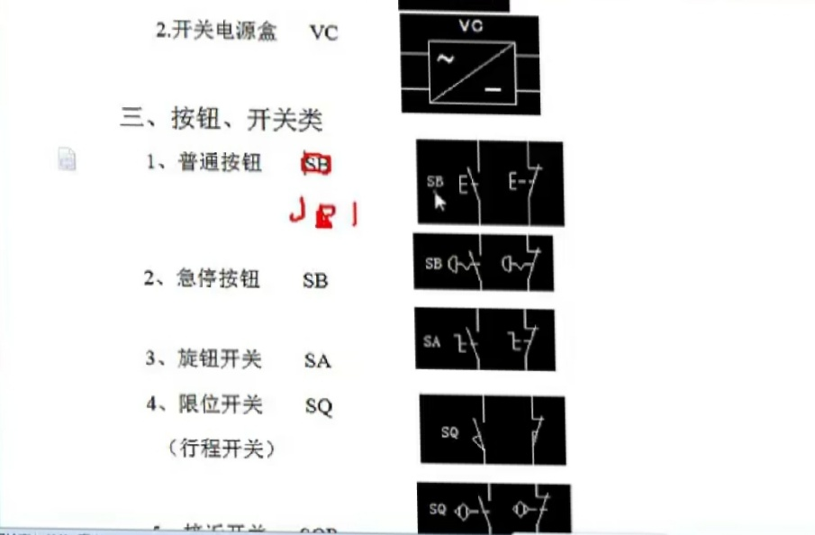

**复合按钮**  
关键词：机械连杆  
常闭先断开，常开后闭合。
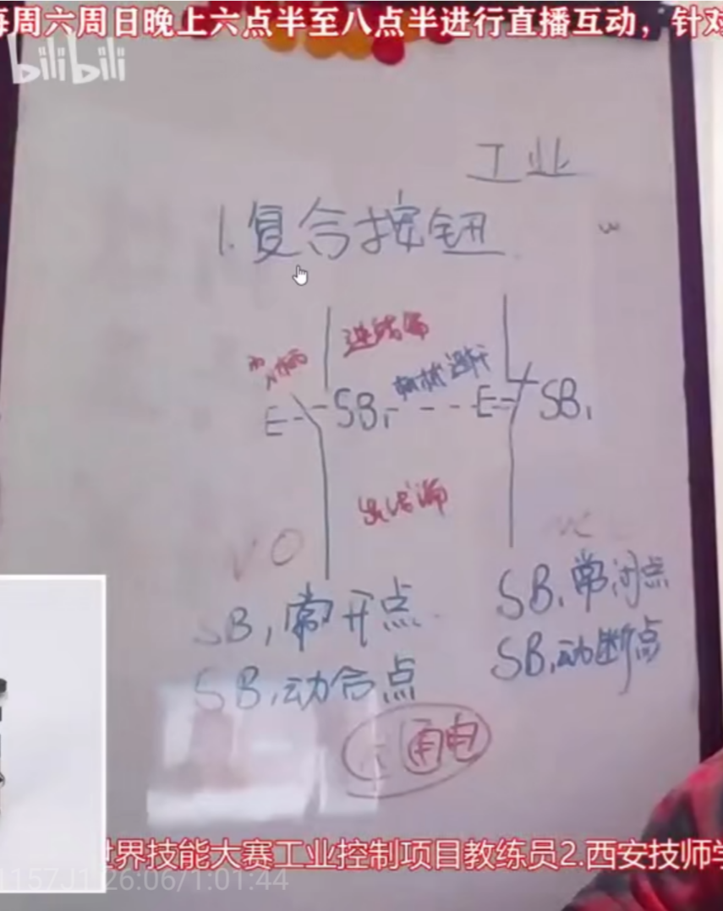

1. SB1常开点（动合点）
2. SB1常闭点（动断点）

**急停**  
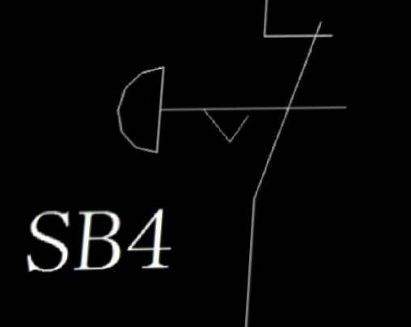

**接近开关**  
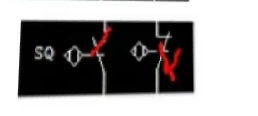
1. 不需要碰到就能开关，有光电感应，金属感应，颜色感应...。
2. 一般用DC24V，接三根线。
      棕色：24V线
      蓝色：0V线
      黑色：信号线（NPN输出0V，PNP输出24V）

## 断路器类  
**空气断路器（空开）**  
1. 符号QS  
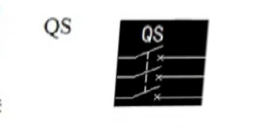

**漏电保护开关**  
1. 漏电（电流出去了，没有回来）就会跳闸。
2. 起到漏电保护作用，漏电电流大于30mA就会跳闸。
3. 当你触碰火线，电流从你身体流过，没有流回去就会漏电，漏电大于30mA就会跳闸。
4. 解决漏电问题后，打上去还跳下来是没有按复位。

**熔断器**  
1. 符号FU
2. 短路保护（电路短路时，电流激增，释放大量热烧断熔断器，从而做到短路保护）

## 继电器类
**交流接触器**

原理图
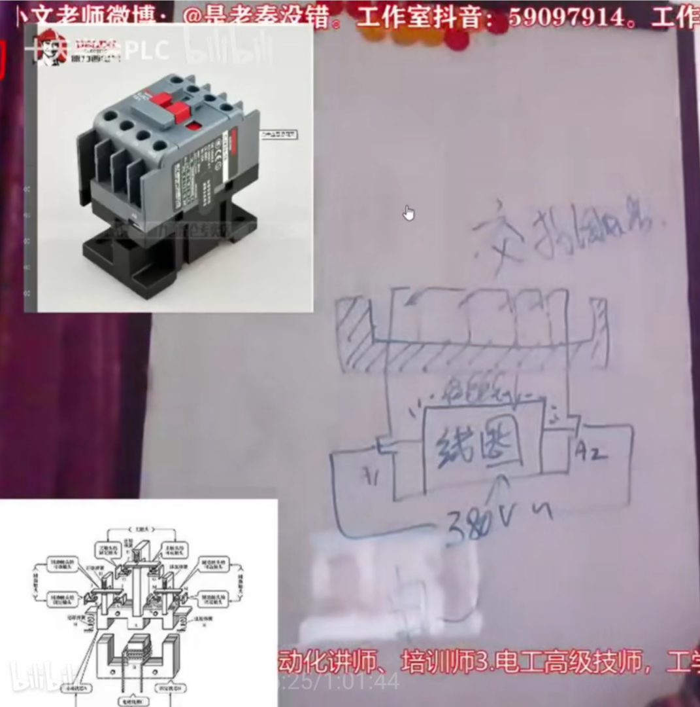
实物图  
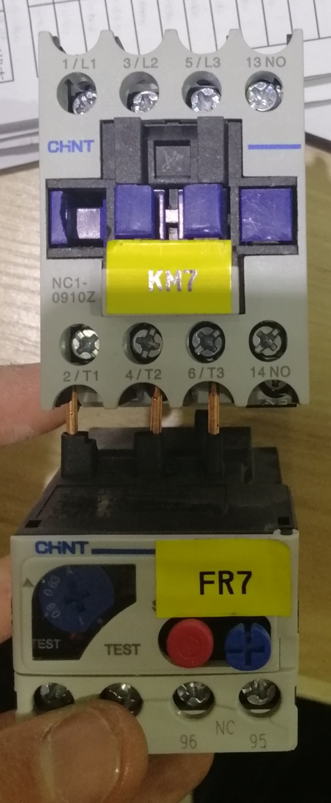

1. 由线圈，主触点+辅助触点（常开辅助触点，常闭辅助触点）组成
2. 主触头有小半圆，辅助触头就是一根线
3. 主触头一般接在主电路，辅助触头接在控制电路
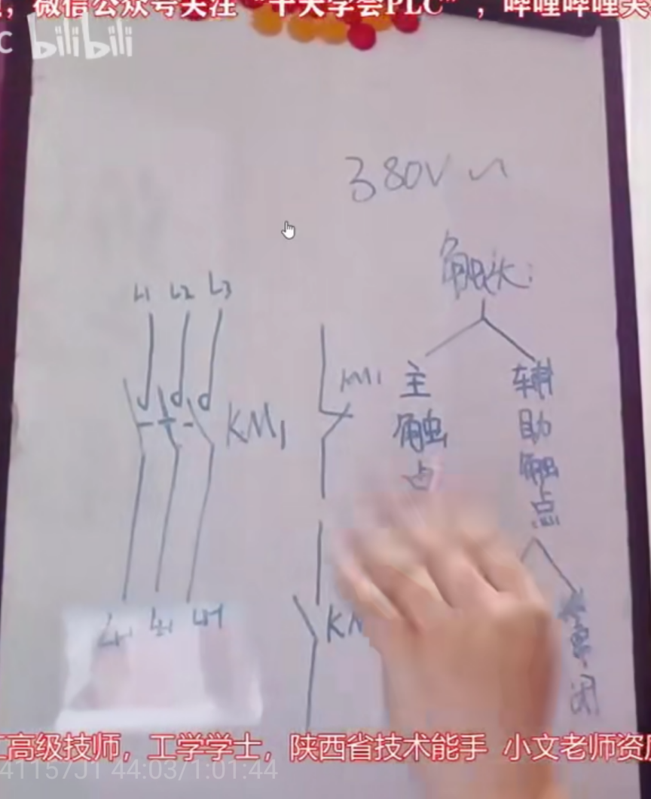

型号认识 NC1-0910Z  
0910接触器型号  
   09  接触器额定电流9A  
   10  辅助触点的状态，只有一组常开辅助触点   
（01：只有一组常闭辅助触点）（11：有一组常开辅助触点和一组常闭辅助触点）（22：有2组常开辅助触点，2组常闭辅助触点）  
NO  常开触点  
NC   常闭触点  
B表示24V，D表示直流线圈  

**中间继电器**  
1. 符号是KA
2. 用小电流控制线圈，用触头控制小负载。
3. 用一个触点控制多个触点（触点不够用）。
4. 接线
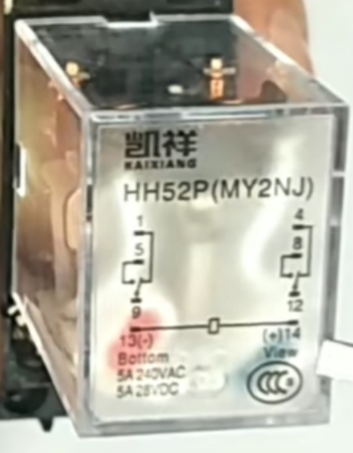
   1. 第一组触点9是公共点，1-9是常闭触点，5-9是常开触点。
   2. 第二组触点12是公共点，4-12是常闭触点，8-12是常开触点。
   3. 13-14是线圈。
   

**热继电器**  
1. 符号 FR
2. 过载保护。
电动机工作状态分为空载，轻载，重载，过载。过载时工作电流增大，大于额定电流，冲击定子绕组绝缘漆的绝缘程度，容易导致电机短路。
3. 分为主触头，辅助触头。
4. 热继电器上的旋钮是调整过载电流（小旋钮是微调），一般按额定电流的1.1-1.25倍进行调整。
  红色小按钮是手动复位，按下时主触点断开，常开辅助触点闭合，用来模拟过载环境绝对不能通电时按下。
5. 与plc的应用，通常常开辅助触点与plcDI连接，热继电器断开时plc控制主回路断开，并报警达成双重保护。
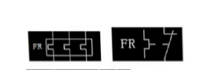

**时间继电器**
1. 符号：KT
2. 分类
通电延时继电器：线圈通电后，触点开始延时 
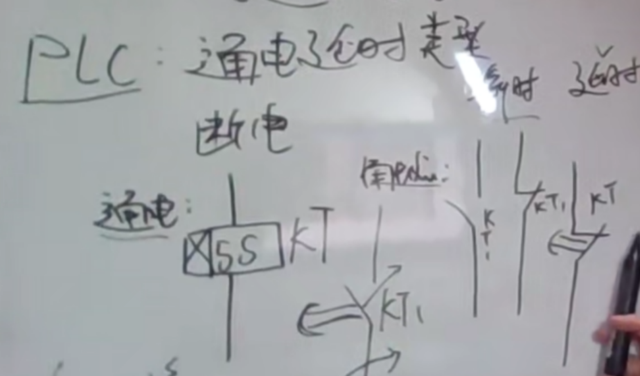 
延时触点：通电延时常开触点，通电延时常闭触点  
断电延时继电器
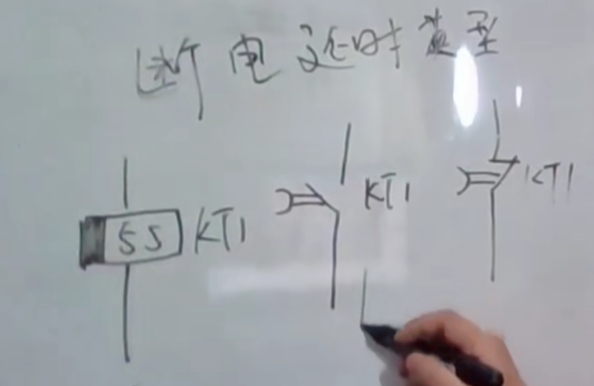
3. 组成
线圈和触点（瞬时触点，延时触点）。  
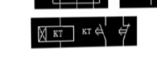
4. plc 中用通电延时继电器逻辑。  

## 变压类
**变压器**
1. 符号：T
2. 将交流电变为交流电
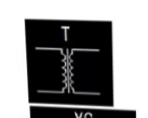

**电源开关盒**
1. 符号VC
2. 交流变直流
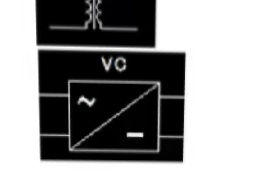

# 电路
## 点动电路
你点它就转
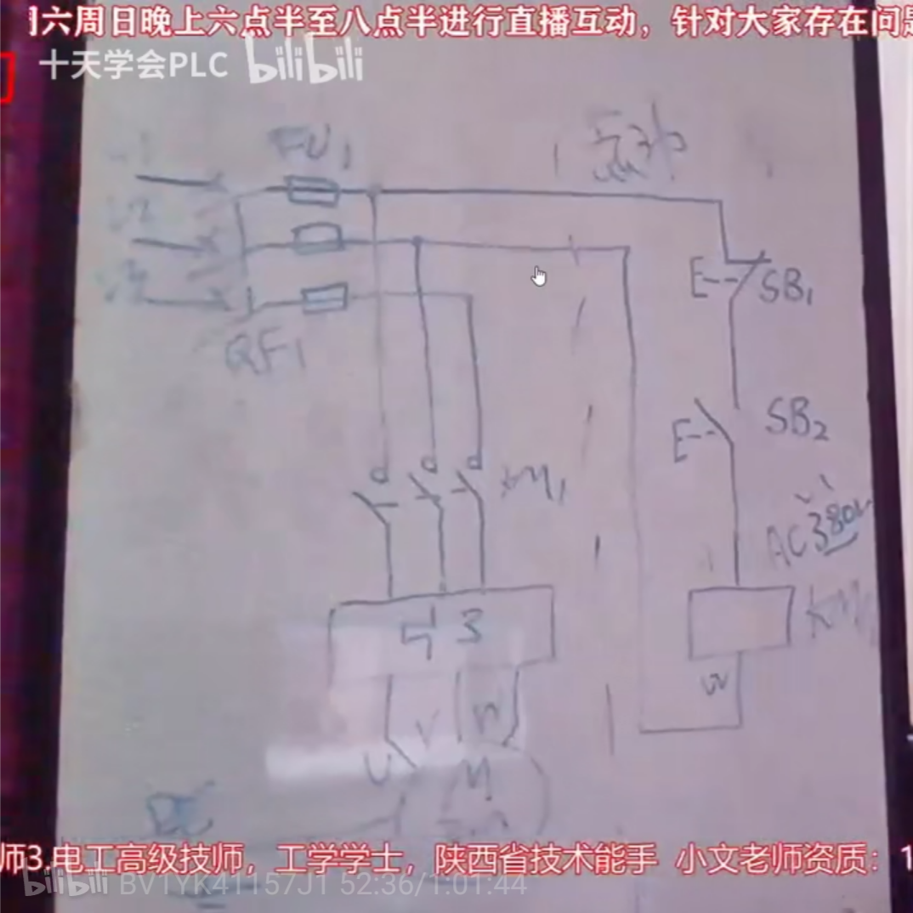

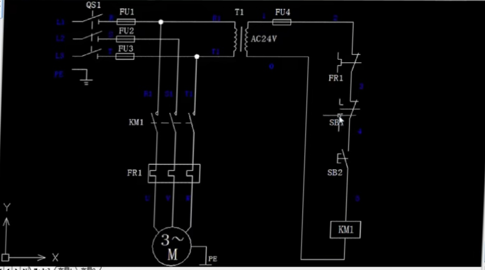

## 自锁
 按下SB2按钮后，线圈KM1有电，线圈有电辅助触头KM1闭合，辅助触头闭合，线圈有电，实现循环。  
当SB2断开时，电机依然可以转。  
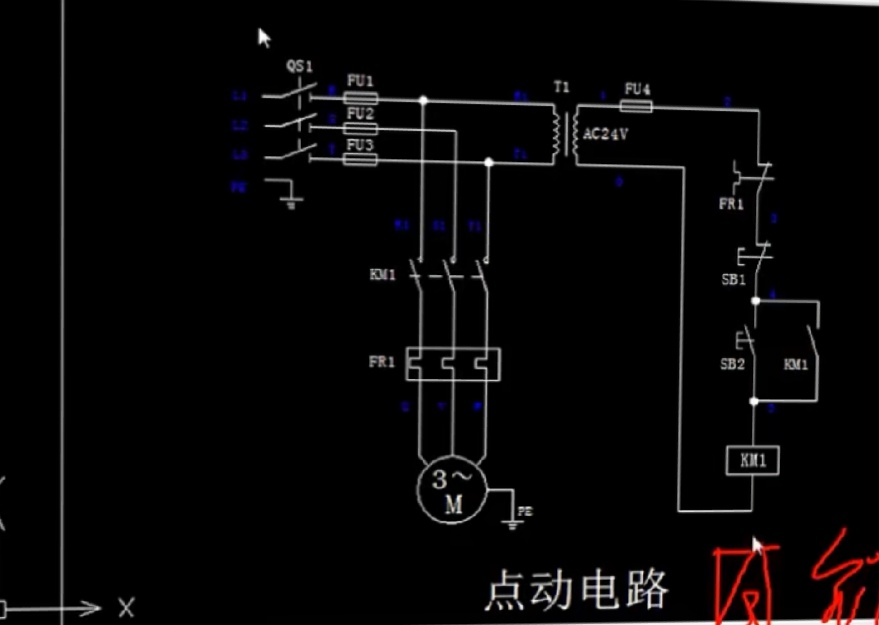

## 三相电机正反转
调整三相电路两根线线序，电机实现反转。  
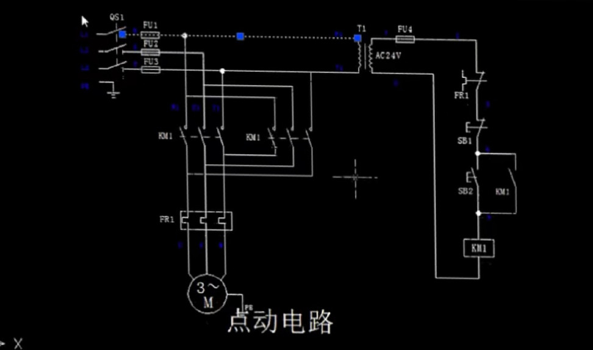

互锁是为了防止电机正转时，激活反转电路。
用自己的常闭触头锁住别人，当自己线圈的点时，常闭触头断开。

## 互锁
互锁是为了防止电机正转时，激活反转电路。  
用自己的常闭触头锁住别人，当自己线圈的点时，常闭触头断开。
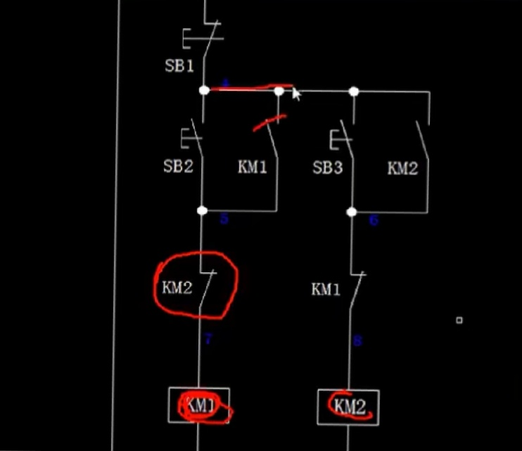

## 电机星形工作原理
三相交流电机绕组一般有三根线。  
星形接法：将三根绕组尾部相连，在头部分别接上三相电源三根线。绕组电压为220v通常用于启动电机。  
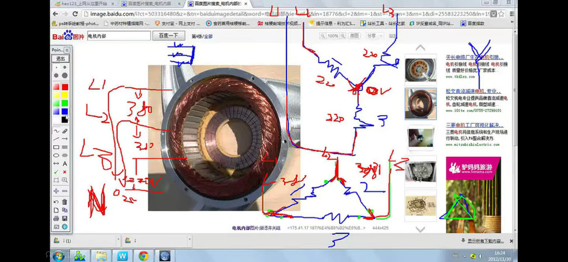

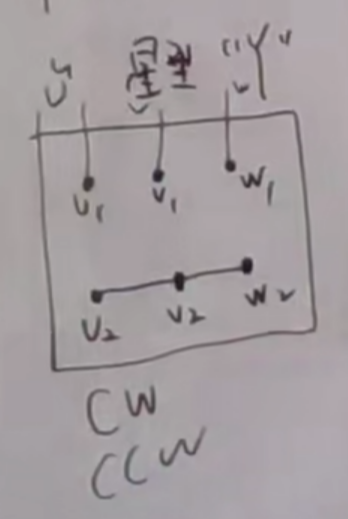
## 三角形接发
将电机三根绕组线首尾相连，绕组电压为380V。用于电机高速运转。 

## 星三角控制电路 
按下启动开关SB2，KM1线圈的电，时间继电器KT1线圈的点，  
KT1常闭触点延时断开，KM2线圈得电一段时间，主电路KM2触点闭合，星形启动一段时间。  
一段时间后，控制电路常闭KT1断开，常开KT1触点闭合，KM3线圈得电，三角电路激活。

## 具有过载保护的双重连锁正反转电路
- 双重连锁（按钮连锁+互锁）

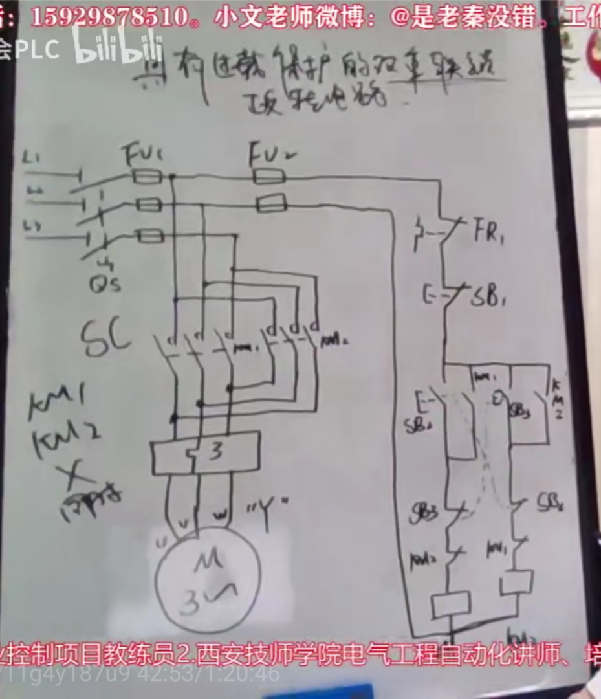

## 电机接法
- 电动机启动电流Ist 是正常电流的4-7倍。  
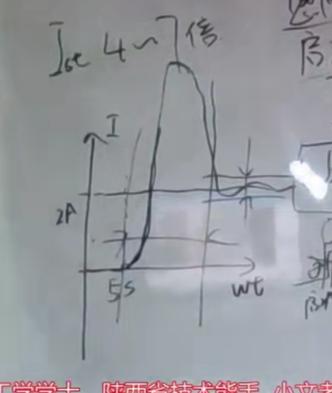

启动电流过大，会对电网的冲击（启动后会吸收电网电流，影响其它用点设备）。  
会使负荷开关误跳闸。 

- 是否选择星三角降压启动

一般电机小于7.5KW不用星三角降压启动。  
但是要根据电路中用电器的多少，变压器的负荷来决定。  
对电机定子绕组绝缘漆的绝缘程度造成冲击。

- 星三角的实际实现  
用电力拖动线路（接触器，时间继电器等）实现。
  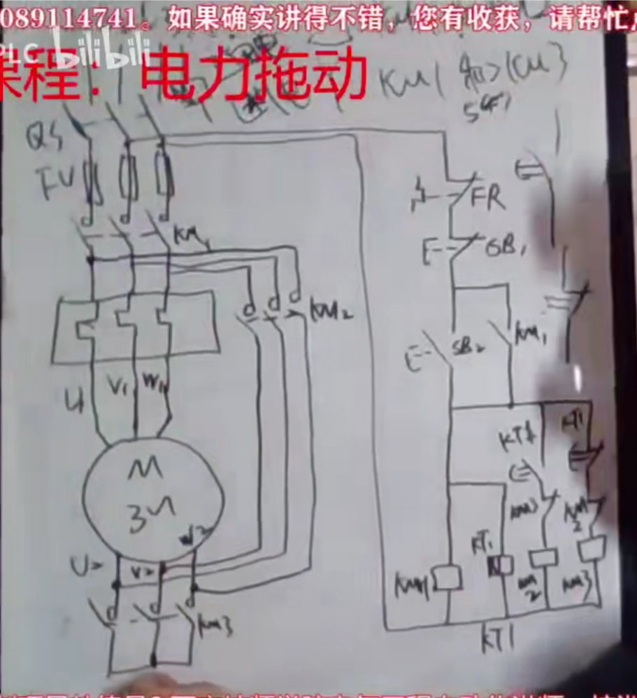用接触器实现。  

**星形接法**  
- 尾尾尾接，首接电源
- 功率是额定功率的1/3

**三角形接法**  
- 首尾相连，首接电源
- 功率等于额定功率

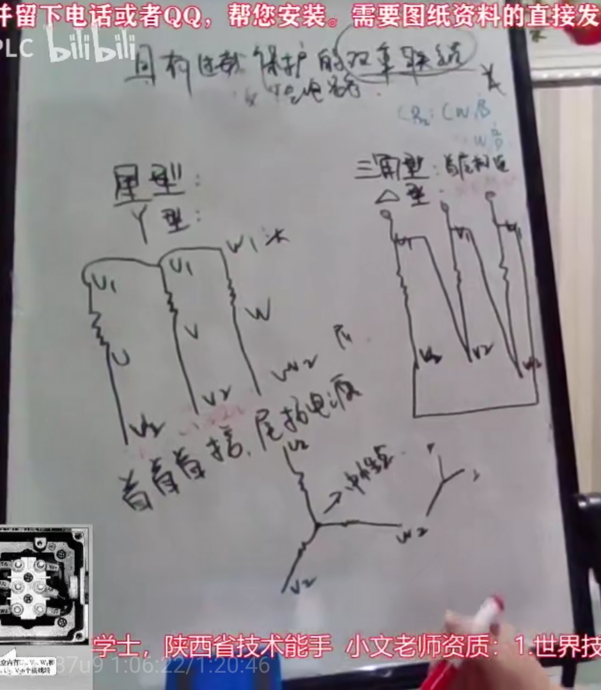

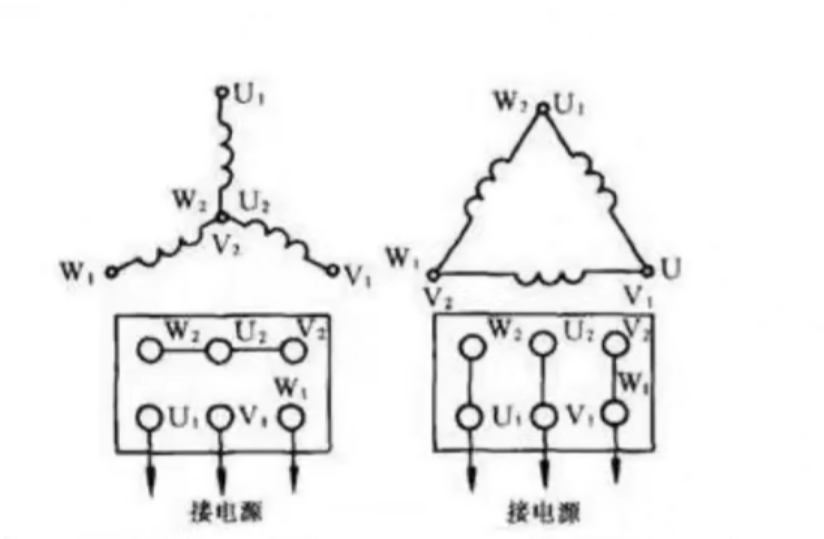